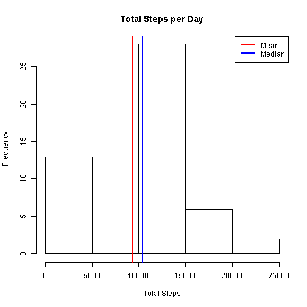

## Report Contents

This report contains the following sections :

* Introduction
* Data Description
* Loading and PreProcessing the data
* Mean total no of steps taken per day
* Average daily activity pattern
* Imputing missing values
* Comparison of activity patterns between weekdays and weekends

## Introduction

It is now possible to collect a large amount of data about personal movement using activity monitoring devices such as a Fitbit, Nike Fuelband, or Jawbone Up. These type of devices are part of the "quantified self" movement - a group of enthusiasts who take measurements about themselves regularly to improve their health, to find patterns in their behavior, or because they are tech geeks. But these data remain under-utilized both because the raw data are hard to obtain and there is a lack of statistical methods and software for processing and interpreting the data.

This assignment makes use of data from a personal activity monitoring device. This device collects data at 5 minute intervals through out the day. The data consists of two months of data from an anonymous individual collected during the months of October and November, 2012 and include the number of steps taken in 5 minute intervals each day.

(source : Reproducible Research : Peer Assessment 1 Instructions)

## Data Description

The dataset is stored in a comma-separated-value (CSV) file (activity.csv) and is located in the activity folder. There are a total of 17,568 observations.

The variables included in this dataset are:

steps: Number of steps taking in a 5-minute interval (missing values are coded as NA)

date: The date on which the measurement was taken in YYYY-MM-DD format

interval: Identifier for the 5-minute interval in which measurement was taken

(source : Reproducible Research : Peer Assessment 1 Instructions)

## Loading and Preprocessing the data

Note : Before running any code, set your working directory to the project folder.

The data was loaded as shown below. No preprocessing of the data was carried out before analysis.


```r
#load required libraries
library(dplyr)
library(ggplot2)

#read the raw data from the activity folder
activity.raw <- read.csv("activity/activity.csv")
```
The summary of the raw data is as shown below :


```r
summary(activity.raw)
```

```
##      steps                date          interval     
##  Min.   :  0.00   2012-10-01:  288   Min.   :   0.0  
##  1st Qu.:  0.00   2012-10-02:  288   1st Qu.: 588.8  
##  Median :  0.00   2012-10-03:  288   Median :1177.5  
##  Mean   : 37.38   2012-10-04:  288   Mean   :1177.5  
##  3rd Qu.: 12.00   2012-10-05:  288   3rd Qu.:1766.2  
##  Max.   :806.00   2012-10-06:  288   Max.   :2355.0  
##  NA's   :2304     (Other)   :15840
```

## Mean total number of steps taken per day

The mean total number of steps taken per day was calculated by first converting the date strings to
R Dates then grouping the raw data by Date. Finally, using dplyr, the total steps per day and the mean steps per day were calculated by summarizing the grouped data.


```r
#convert date strings to R dates
activity.raw$date <- as.Date(activity.raw$date,"%Y-%m-%d")

#group activity.raw by date
activity.raw.byDate <- group_by(activity.raw,date)

#Calculate Total Steps per day
sumSteps.raw <- summarize(activity.raw.byDate,
          total.steps.perDay = sum(steps,na.rm = TRUE),
          average.steps.perDay = mean(total.steps.perDay,na.rm = TRUE))
```

A summary of the grouped calculation is as shown below.


```r
#print summary
s <- summary(sumSteps.raw$total.steps.perDay)
print(s)
```

```
##    Min. 1st Qu.  Median    Mean 3rd Qu.    Max. 
##       0    6778   10400    9354   12810   21190
```

A histogram of the total steps per day using the base plotting system is shown below.
Lines have been added to the plot indicating the Mean and Median values.


```r
#histogram
hist(sumSteps.raw$total.steps.perDay,main = "Total Steps per Day",xlab = "Total Steps")
abline(v = s[4],col="red",lwd=2)
abline(v = s[3],col="blue",lwd=2)
legend("topright",legend = c("Mean","Median"),lty=c(1,1),lwd=c(2,2),col=c("red","blue"))
```

 

From the summary, and, as shown on the plot, the mean and median values are as follows:


```r
print(paste("Mean of Total Steps Taken per Day = ",s[4],sep = ""))
```

```
## [1] "Mean of Total Steps Taken per Day = 9354"
```

```r
print(paste("Median of Total Steps Taken per Day = ",s[3],sep = ""))
```

```
## [1] "Median of Total Steps Taken per Day = 10400"
```

## Average daily activity pattern

The average daily activity pattern as shown below was calculated by first grouping the raw data by
5 minute interval, then summarizing to get the average number of steps per interval. The results
were then plotted as a time-series plot.


```r
#time-series plot of average steps per time interval
#group by interval
activity.raw.byInterval <- group_by(activity.raw,interval)
intervalSteps <- summarize(activity.raw.byInterval,
                      avg.steps.perInterval = mean(steps,na.rm = TRUE))

#Highest no of steps
max.steps <- max(intervalSteps$avg.steps.perInterval)

#Interval containing the highest no of steps
max.interval.steps <- intervalSteps$interval[which.max(intervalSteps$avg.steps.perInterval)]
```

```r
#Daily Activity Pattern Plot
plot(intervalSteps$interval,intervalSteps$avg.steps.perInterval,type = "l", lty = 1,
     lwd = 1.5,col="blue",
     main="Daily Activity Pattern",xlab = "Interval",ylab = "Average Steps")

#add vertical line indicating the interval with the highest number of steps
abline(v=max.interval.steps,lty=2,lwd=1.5,col="red")
legend("topright",legend = "Highest Steps",lty=2,lwd=1.5,col="red")
```

 


```r
print(paste("Interval which contains the highest number of steps (",
            round(max.steps,0),") is interval : ",
            max.interval.steps,sep = "")) 
```

```
## [1] "Interval which contains the highest number of steps (206) is interval : 835"
```

## Imputing missing values

From the summary of the raw data shown below, it can be seen that there are 2304 missing steps values.


```r
summary(activity.raw)
```

```
##      steps             date               interval     
##  Min.   :  0.00   Min.   :2012-10-01   Min.   :   0.0  
##  1st Qu.:  0.00   1st Qu.:2012-10-16   1st Qu.: 588.8  
##  Median :  0.00   Median :2012-10-31   Median :1177.5  
##  Mean   : 37.38   Mean   :2012-10-31   Mean   :1177.5  
##  3rd Qu.: 12.00   3rd Qu.:2012-11-15   3rd Qu.:1766.2  
##  Max.   :806.00   Max.   :2012-11-30   Max.   :2355.0  
##  NA's   :2304
```

The strategy used to impute the missing values is to replace them with the mean steps value of the corresponding 5 minute interval from intervalSteps calculated in the daily activity pattern section above.

First, a copy of the raw dataset is made to hold the cleaned up data.

```r
#copy the raw dataset
activity.clean <- activity.raw
```
The missing values are then extracted from the raw dataset.

```r
#extract the NA's
steps.na <- subset(activity.raw,is.na(steps))
```
Get the number of missing days

```r
#Get number of missing days
missing.days <- length(unique(steps.na$date))
```
Replace the missing values with those in intervalSteps, replicating by number of missing days.


```r
#replace NAs with those in intervalSteps replicating by no of missing days
steps.na$steps <- rep(intervalSteps$avg.steps.perInterval,missing.days)
```

Finally, replace the missing values in the raw data copy to produce a cleaned data set.


```r
#replace the NA's in the activity dataset
activity.clean$steps <- replace(activity.clean$steps,is.na(activity.clean$steps),steps.na$steps)
```

The summary of the cleaned data set is as follows:


```r
summary(activity.clean)
```

```
##      steps             date               interval     
##  Min.   :  0.00   Min.   :2012-10-01   Min.   :   0.0  
##  1st Qu.:  0.00   1st Qu.:2012-10-16   1st Qu.: 588.8  
##  Median :  0.00   Median :2012-10-31   Median :1177.5  
##  Mean   : 37.38   Mean   :2012-10-31   Mean   :1177.5  
##  3rd Qu.: 27.00   3rd Qu.:2012-11-15   3rd Qu.:1766.2  
##  Max.   :806.00   Max.   :2012-11-30   Max.   :2355.0
```

A histogram plot of the Total Steps per day after replacing the missing steps values is as shown below. Lines have been added to the plot indicating the Mean and Median values.


```r
#group activity.clean by date
activity.clean.byDate <- group_by(activity.clean,date)

#Calculate Total Steps per day, plot as a histogram and report the mean and median
sumSteps.clean <- summarize(activity.clean.byDate,
                      total.steps.perDay = sum(steps,na.rm = TRUE),
                      average.steps.perDay = mean(total.steps.perDay,na.rm = TRUE))

#print summary
s <- summary(sumSteps.clean$total.steps.perDay)
print(s)
```

```
##    Min. 1st Qu.  Median    Mean 3rd Qu.    Max. 
##      41    9819   10770   10770   12810   21190
```


```r
#histogram
hist(sumSteps.clean$total.steps.perDay,main = "Total Steps per Day",xlab = "Total Steps")
abline(v = s[4],col="red",lwd=2)
abline(v = s[3],col="blue",lwd=2)
legend("topright",legend = c("Mean","Median"),lty=c(1,1),lwd=c(2,2),col=c("red","blue"))
```

 

From the summary, and, as shown on the plot, the mean and median values are as follows:


```r
print(paste("Mean of Total Steps Taken per Day = ",s[4],sep = ""))
```

```
## [1] "Mean of Total Steps Taken per Day = 10770"
```

```r
print(paste("Median of Total Steps Taken per Day = ",s[3],sep = ""))
```

```
## [1] "Median of Total Steps Taken per Day = 10770"
```

The result of replacing the missing steps values is that the cleaned data Mean and Medians are now
the same, and the data is less skewed towards the lower values. The distribution of the data now
appears more normal.

## Comparison of activity patterns between weekdays and weekends

To compare the activity patterns bewteen weekdays and weekends, we first add columns to the cleaned
dataset to indicate the day of the week the activity took place (day) and whether this was a weekday or weekend (period). The period is also converted to a factor to facilitate the creation of the panel plot.


```r
#add a column indicating day of the week and a column indicating weekday or weekend
activity.clean <- mutate(activity.clean,
                         day = weekdays(activity.clean$date),
                         period = ifelse(day == "Saturday" | day == "Sunday",
                                         "weekend","weekday"))

#convert period to a factor variable
activity.clean$period <- as.factor(activity.clean$period)
```

A panel plot of the activity patterns, split by period, created using ggplot2, is shown below.


```r
#time-series panel plot of average steps per weekend/weekday time interval
#group by period and interval
activity.clean.byPeriod <- group_by(activity.clean,period,interval)
intervalSteps <- summarize(activity.clean.byPeriod,
                           avg.steps.perInterval = mean(steps,na.rm = TRUE))

ggplot(intervalSteps,aes(interval,avg.steps.perInterval)) +
    geom_line(group = 1) + 
    facet_wrap(~ period,ncol = 1) +
    ggtitle("Weekday/Weekend Activity Comparison") +
    labs(x="Interval",y="Average Steps Per Interval")
```

 

Some initial interesting observations can be made from the plots of weekend and weekday activity patterns.

* Weekday activity between intervals 500 and approx 750 is higher than the corresponding weekend intervals, perhaps indicating that the subject begins his day later on a weekend.
* Peak activity at around intervals 750 to 900 is higher on a weekday, perhaps due to travelling to work.
* Overall, weekend activity is higher than that of weekday during the middle intervals, perhaps indicating that the subject is more active at weekends due to, perhaps, sporting, shopping and other leisure activities taking place at the weekend.
* There is a small activity peak at around interval 2000 over the weekend, perhaps indicating that the subject is invloved in entertainment activities such as eating-out, going to the cinema etc. on a weekend.

Further analysis of the weeday/weekend activities could result in a more detailed interpretation of the results.
